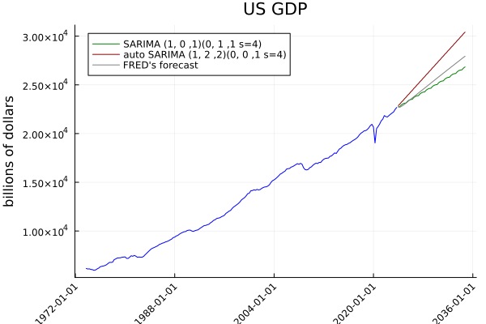

[build-img]: https://github.com/LAMPSPUC/SARIMAX.jl/actions/workflows/ci.yml/badge.svg?branch=master
[build-url]: https://github.com/LAMPSPUC/SARIMAX.jl/actions/workflows/ci.yml

[codecov-img]: https://codecov.io/gh/LAMPSPUC/SARIMAX.jl/branch/master/graph/badge.svg?token=6Zhd8Jiub3
[codecov-url]: https://codecov.io/github/LAMPSPUC/SARIMAX.jl

[docs-img]: https://img.shields.io/badge/docs-latest-blue.svg
[docs-url]: https://lampspuc.github.io/SARIMAX.jl/dev/

# Sarimax.jl

| **Build Status** | **Coverage** | **Documentation** |
|:-----------------:|:-----------------:|:-----------------:|
| [![Build Status][build-img]][build-url] | [![codecov][codecov-img]][codecov-url]| [![docs][docs-img]][docs-url] |

Introducing Sarimax.jl, a groundbreaking Julia package that redefines SARIMA (Seasonal Autoregressive Integrated Moving Average) modeling by seamlessly integrating the JuMP framework — a powerful optimization modeling language. Unlike traditional SARIMA methods, Sarimax.jl leverages the optimization capabilities of JuMP, allowing for precise and customizable SARIMA models.

## Index
* [Features](#features)
* [Quickstart](#quickstart)
    * [Stationarity](#stationarity)
    * [Sarima model](#sarima-model)
* [Auto SARIMA method](#auto-sarima-method)
* [SARIMA models with explanatory variable](#sarima-models-with-explanatory-variable)
* [Contributing](#contributing)
* [References](#references)

## Features

* Fit using Mean Squared Errors objective function
* Fit using Maximum Likelihood estimation
* Fit using bilevel objective function
* Auto Sarima Model
* Auto Sarima Model with exogenous variables 
* Simulate scenarios
* Integrate and differentiate time series
* Provide evaluation criteria values (aic, aicc, bic)

## Quickstart
Using the dataset air passsangers, plot the time series to visualize the data and its features. 
Since it shows variation that increases with the level of the series, a logarithmic transformation is useful. 


```julia
import Pkg
Pkg.add(url = "https://github.com/LAMPSPUC/SARIMAX.jl")
using Sarimax
airp = loadDataset(AIR_PASSENGERS)
airp_log = log.(airp)
```

### Stationarity

In an autoregressive moving averages model, the original series should be stationary. This prevents the predictive variance from increasing without bounds as the forecast horizon increases. In some cases, to achieve stationarity, the series is differentiated seasonally and non-seasonally. Choose the hyperparameters d and D to ensure stationarity.


```julia

diff_series = differentiate(airp_log,1,1,12)
values_diff::Vector{Float64} = values(diff_series)
int_series = integrate(values(airp_log[1:13]), values_diff,1,1,12)

```
To return the original series through the differentiated one, it is necessary to have s×D+d previous values of the original series. The recovered values are a combination of the previous terms in which the coefficients are the same as Newton's binomial coefficients.  

```julia
diff_2_1 = differentiate(airp_log,2,1,12)
values_diff_2_1::Vector{Float64} = values(diff_2_1)
int_2_1 = integrate(values(airp_log[1:14]), values_diff_2_1,2,1,12)
coeff_2_1 = differentiatedCoefficients(2, 1, 12)
print(coeff_2_1)

diff_4_1 = differentiate(airp_log,4,1,12)
values_diff_4_1::Vector{Float64} = values(diff_4_1)
int_4_1 = integrate(values(airp_log[1:16]), values_diff_4_1,4,1,12)
coeff_4_1 = differentiatedCoefficients(4, 1, 12)
print(coeff_4_1)
```

## Sarima model 

A SARIMA model is constructed by adding an autoregressive component and an error moving average component, considering seasonal and non-seasonal behavior.

### Objective Function

$$
\underset{c, \phi_i, \theta_i, \Phi_i, \Theta_i, \epsilon_t}{\text{minimize}} \quad \sum_{t=1}^{T} \epsilon_t^2 \\

\text{subject to} \quad y'_t = c + \sum_{i=1}^{p} \phi_i y'_{t-i} + \sum_{i=1}^{q} \theta_i \epsilon_{t-i} + \\ \quad \quad \sum_{i=1}^{P} \Phi_i y'_{t-s \times i} + \sum_{i=1}^{Q} \Theta_i \epsilon'_{t-s \times i} + \epsilon_t , \quad \forall t \in \{1,\cdots,T\}
$$


Split the data to reserve a portion for testing the forecast: 

```julia
trainingSet, testingSet = splitTrainTest(airp_log)
stepsAhead = length(testingSet)

```


The function SARIMA generates a model given the hyperparameters: degree of differencing (d,D), autoregressive order (p, P) and moving average order (q,Q). 

The function fit!(model,objectiveFunction) returns the model with the coefficients that minimize the square root error by default.

The objective funcion could also be the maximum likelihood or bilevel. 

```julia
model = SARIMA(trainingSet, 1, 0, 1; seasonality=12, P=0, D=1, Q=2, silent=false, allowMean=false)
fit!(model; objectiveFunction="mse")
print(model)
aicc(model)
```

Predict the SARIMA model for the next  periods. Simulate scenarios and compare to the forecast. 

```julia
forecast = predict!(model, stepsAhead)
scenarios = simulate(model, stepsAhead, 200)
```


## Auto SARIMA method

The function automatically fits the best SARIMA model according to the specified parameters. The implemented method uses the Hyndman algorithm to adjust the hyperparameters at each iteration.

The coefficients, by default, minimize the squared root error. The best model is the one that minimizes the information criteria. By default, Akaike’s Information Criterion with a correction for small sample sizes (AICc) is used.

Another way to evaluate a model is through the log-likelihood; the best model would be the one that maximizes this value. 

```julia
#USING MSE
autoModelMSE = auto(trainingSet; seasonality=12, objectiveFunction="mse")
print(autoModelMSE)

#USING ML
autoModelML = auto(trainingSet; seasonality=12, objectiveFunction="ml")
bic(autoModelML)
loglikelihood(autoModelML)
```
Predicting the next values: 

```julia
autoForecast = predict!(autoModelMSE, stepsAhead)
loglike(autoModelMSE)
aicc(autoModelMSE)
```


## SARIMA models with explanatory variable

This function incorporates an exogenous explanatory variable in the SARIMA model. The exogenous variable should start at the same date as the dependent variable and should have already been predicted for the steps ahead for a forecast to be made. 

###  US GDP using noncyclical Rate of Unemployment
Using Gross Domestic Product (GDP) and the noncyclical Rate of Unemployment data from the Federal Reserve Economic Data (FRED), both datasets incorporate FRED's forecasts.  The series to be estimated (GDP) is considered up to current time while  FRED's forecast is stored in another variable for comparison with SARIMA's estimation. 


```julia
gdp = loadDataset(GDPC1)
y= gpd[1:300]
future_y = gdp[301:end]

nrou_x = loadDataset(NROU)
```


### SARIMA model

```julia 
model_exogenous = SARIMA(y,nrou_x, 1, 0, 1; seasonality=4, P=0, D=1, Q=1, silent=false, allowMean=false)
fit!(model_exogenous;objectiveFunction="mse")
print(model_exogenous)
aicc(model_exogenous)
forecast_exog = predict!(model_exogenous,length(future_y))
```
### auto SARIMA model

```julia 
model_auto_exogenous = auto(y;exog=nrou_x,seasonality=4, objectiveFunction="mse")
print(model_auto_exogenous)
aicc(model_auto_exogenous)
forecast_auto_exog = predict!(model_auto_exogenous,length(future_y))
```



## Contributing

* PRs such as adding new models and fixing bugs are very welcome!
* For nontrivial changes, you'll probably want to first discuss the changes via issue.

## References 
- Hyndman, RJ and Khandakar. "Automatic time series forecasting: The forecast package for R." Journal of Statistical Software, 26(3), 2008.

- Hyndman, R. J., & Athanasopoulos, G. (2021). Forecasting: Principles and Practice (3rd ed.). OTexts. ISBN 978-0-6488317-0-5.